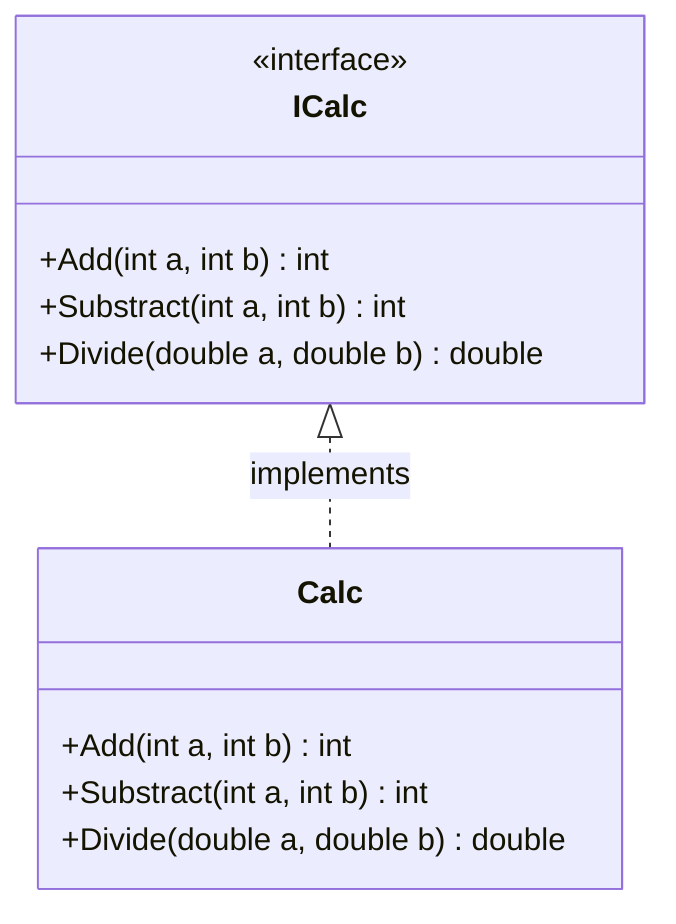

```mermaid
classDiagram
    class ICalc {
        <<interface>>
        +Add(int a, int b) int
        +Substract(int a, int b) int
        +Divide(double a, double b) double
    }
    
    class Calc {
        +Add(int a, int b) int
        +Substract(int a, int b) int
        +Divide(double a, double b) double
    }
    
    ICalc <|.. Calc : implements
```
